# Crassus Windows privilege escalation discovery tool

# Quick start

1. In [Process Monitor](https://learn.microsoft.com/en-us/sysinternals/downloads/procmon), select the `Enable Boot Logging` option. 
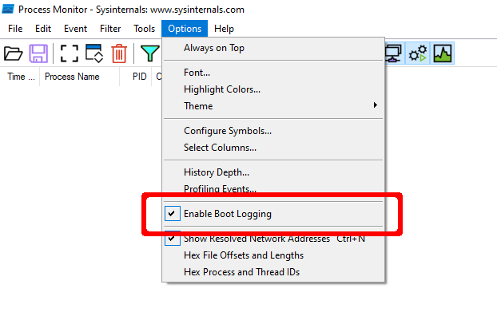
2. Reboot.
3. Once you have logged in and Windows has settled, run Process Monitor once again.
4. When prompted, save the boot log, e.g., to `raw.PML`.
5. Reset the default Process Monitor filter using `Ctrl-R`.
6. Save this log file, e.g., to `boot.PML`.
7. Run `Crassus.exe boot.PML`.
8. Investigate any green colored results and the corresponding entries in `results.csv`.

# Table of Contents

* [Why "Crassus"](#why-crassus)
    * [Did you really make yet another privilege escalation discovery tool?](#did-you-really-make-yet-another-privilege-escalation-discovery-tool)
    * [Features](#features)
    * [Flowchart](#flowchart)
* [Screenshots](#screenshots)
    * [Crassus Execution](#Crassus-execution)
    * [CSV Output](#csv-output)
    * [Exports](#output-exports)
    * [Export DLL Functions](#export-dll-functions)
    * [Export DLL Ordinals](#export-dll-ordinals)
* [Getting Crassus.exe](#getting-crassusexe)
    * [Building with Visual studio](#building-with-visual-studio)
    * [Using precompiled Crassus.exe](#using-precompiled-crassusexe)
* [Usage](#usage)
    * [Execution Flow](#execution-flow)
    * [Command Line Arguments](#command-line-arguments)
    * [Examples](#examples)
    * [Proxy DLL Template](#proxy-dll-template)
    * [openssl.cnf Template](#openssl-template)
* [Compiling Proxy DLLs](#compiling-proxy-dlls)
    * [Visual Studio](#visual-studio)
    * [MinGW](#mingw)
* [Real World Examples](#real-world-examples)
    * [Acronis True Image](#acronis-true-image)
    * [Atlassian Bitbucket](#atlassian-bitbucket)
    * [McAfee](#mcafee)
    * [Microsoft SQL Server 2022](#microsoft-sql-server-2022)
* [Troubleshooting](#troubleshooting)
    * [Missing files not loaded](#missing-file-not-executed)
    * [Code executed with unexpected privileges](#code-executed-with-unexpected-privileges)
    * [Findings disappear on reboot](#findings-disappear-on-reboot)
* [Contributions](#contributions)
* [Credits](#credits)

# Why "Crassus"?

Accenture made a tool called [Spartacus](https://github.com/Accenture/Spartacus), which finds DLL hijacking opportunities on Windows. Using Spartacus as a starting point, we created Crassus to extend Windows privilege escalation finding capabilities beyond simply looking for missing files. The ACLs used by files and directories of privileged processes can find more than just [looking for missing files](https://vuls.cert.org/confluence/display/Wiki/2021/06/21/Finding+Privilege+Escalation+Vulnerabilities+in+Windows+using+Process+Monitor) to achieve the goal.

## Did you really make yet another privilege escalation discovery tool?

...but with a twist as Crassus is utilizing the [SysInternals Process Monitor](https://learn.microsoft.com/en-us/sysinternals/downloads/procmon) and is parsing raw PML log files. Typical usage is to generate a boot log using Process Monitor and then parse it with Crassus. It will also automatically generate source code for proxy DLLs with all relevant exports for vulnerable DLLs.

## Features

* Parsing ProcMon PML files natively. The log (PML) parser has been implemented by porting partial functionality to C# from https://github.com/eronnen/procmon-parser/. You can find the format specification [here](https://github.com/eronnen/procmon-parser/tree/master/docs).
* Crassus will create source code for proxy DLLs for all missing DLLs that were identified. For instance, if an application is vulnerable to DLL Hijacking via `version.dll`, Crassus will create `version.cpp` and `version.def` files for you with all the exports included in it. By default the proxy DLLs will launch `calc.exe`. Build scripts are included to build the DLLs on Visual Studio or MinGW.
* For other events of interest, such as creating a process or loading a library, the ability for unprivileged users to modify the file or any parts of the path to the file is investigated.
* Able to process large PML files and store all events of interest in an output CSV file.

## Flowchart

The general gist of how Crassus works can be summarized in this flowchart:


# Screenshots

## Crassus Execution

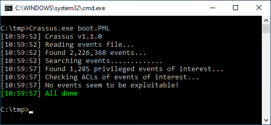

## CSV Output

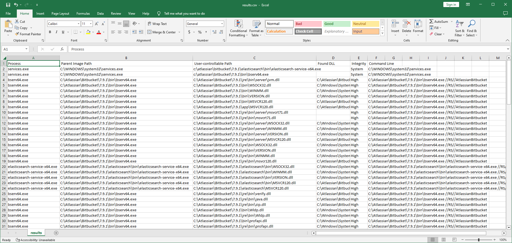

## Output Exports

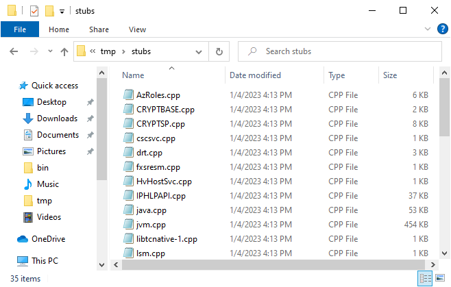

## Export DLL Functions

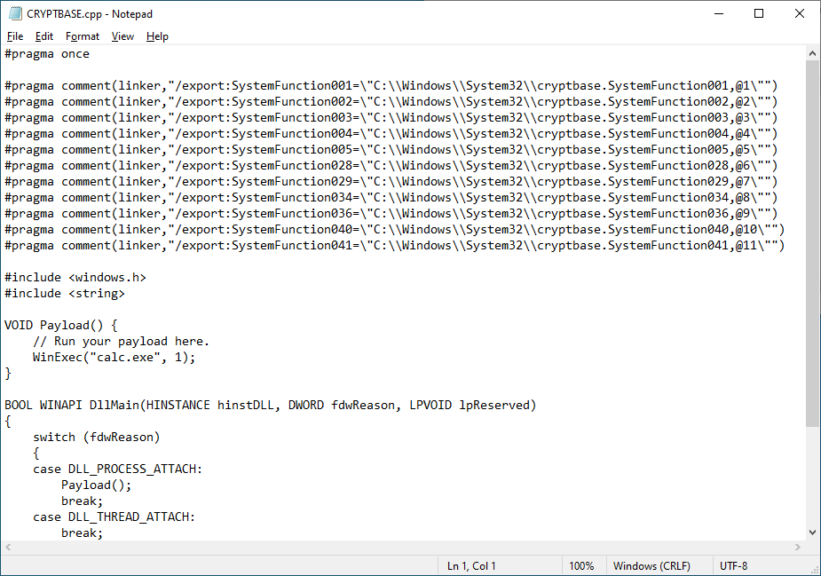

## Export DLL Ordinals

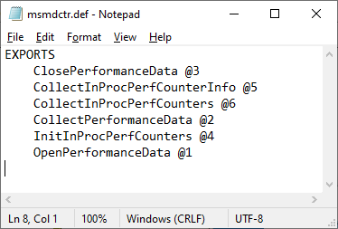

# Getting Crassus.exe

## Building with Visual Studio

Crassus was developed as a Visual Studio 2019 project. To build `Crassus.exe`:
1. Open `Crassus.sln`
2. Press `Ctrl+Shift+B` on your keyboard

## Using precompiled Crassus.exe

If you trust running other people's code without knowing what it does, `Crassus.exe` is [provided in this repository](./binaries/Crassus.exe).

# Usage

## Execution Flow

1. In [Process Monitor](https://learn.microsoft.com/en-us/sysinternals/downloads/procmon), select the `Enable Boot Logging` option. 

2. Reboot.
3. Once you have logged in and Windows has settled, optionally also run [scheduled tasks that may be configured to run with privileges](https://gist.github.com/wdormann/8afe4edf605627ee4f203861b6cc3a1c).
4. Run Process Monitor once again.
5. When prompted, save the boot log.
6. Reset the default Process Monitor filter using `Ctrl-R`.
7. Save this log file, e.g., to `boot.PML`. The reason for re-saving the log file is twofold:
    1. Older versions of Process Monitor do not save boot logs as a single file.
    2. Boot logs by default will be unfiltered, which may contain extra noise, such as a local-user DLL hijacking in the launching of of Process Monitor itself.

## Command Line Arguments

| Argument                  | Description |
| ------------------------- | ----------- |
| `<PMLFILE>`                   | Location (file) of the existing ProcMon event log file.|
| `--verbose`               | Enable verbose output. |
| `--debug`                 | Enable debug output. |

## Examples

Parse the Process Monitor boot log saved in `boot.PML`. All vulnerable paths will be saved as `results.csv` and all proxy DLL source files in the `stubs` subdirectory.

```
C:\tmp> Crassus.exe boot.PML
```


## Proxy DLL Template

Below is the template that is used when generating proxy DLLs., For DLLs that are found by Crassus, the proxy DLL will contain the same export names as specified in `%_EXPORTS_%`, as well as the same ordinals as specified in the `.def` file. Crassus will detect whether the DLL needs to be built as a 32-bit library or a 64-bit library by looking at the architecture of the parent process, and tagging the source code in the `%_BUILD_AS_%` field accordingly.

If the real DLL cannot be found using the Process Monitor log, or if the export name is problematic, the build scripts will fall back to creating a DLL without specified exports.


```cpp
#pragma once
    
//%_BUILD_AS%

#include <windows.h>;

extern "C" {

  VOID Payload() {
      // Run your payload here.
      WinExec("calc.exe", 1);
  }

  BOOL WINAPI DllMain(HINSTANCE hinstDLL, DWORD fdwReason, LPVOID lpReserved)
  {
      switch (fdwReason)
      {
      case DLL_PROCESS_ATTACH:
          Payload();
          break;
      case DLL_THREAD_ATTACH:
          break;
      case DLL_THREAD_DETACH:
          break;
      case DLL_PROCESS_DETACH:
          break;
      }
      return TRUE;
  }


  #ifdef ADD_EXPORTS
  %_EXPORTS_%
  #endif
}
```

## openssl.cnf Template

For applications that unsafely use the `OPENSSLDIR` variable value, a crafted `openssl.cnf` file can be placed in the noted location. For this example, the software will load `C:\tmp\calc.dll`. Be sure to use a 32-bit library to target 32-bit processes, and a 64-bit library to target 64-bit processes.

```openssl_conf = openssl_init
[openssl_init]
# This will attempt to load the file c:\tmp\calc.dll as part of OpenSSL initialization
# Build scripts should detect whether the calc.dll library needs to be built as 32-bit or 64-bit
/tmp/calc = asdf
```

# Compiling Proxy DLLs

## Visual Studio

Compilation is possible using the `cl.exe` binary included with Visual Studio. Specifically:
```
cl.exe /DADD_EXPORTS /D_USRDLL /D_WINDLL <target>.cpp /LD /Fe<target>.dll /link /DEF:<target>.def
```

To automate the build process, including specifying whether the library should be 64-bit or 32-bit:
1. Open the Visual Studio Developer Command Prompt.
2. Build the DLLs with the `build.bat` script.
3. Rename the compiled file as necessary if the vulnerable file name ends with something other than `.dll`.

**Note:** Due to an unfortunate behavior with `vcvarsall.bat`, which is [definitely not a bug](https://developercommunity.visualstudio.com/t/vcvarsallbat-reports-the-input-line-is-too-long-if/257260#T-N258712), you may encounter trouble attempting to run `build.bat` more than once in the same Visual Studio Developer Command Prompt session. If you encounter an error, simply close the window and launch it again.

## MinGW

If Visual Studio isn't readily available, proxy DLLs can be compiled with [MinGW-w64](https://www.mingw-w64.org/) instead. On an Ubuntu platform for example, MinGW can be installed via the following: `sudo apt install g++-mingw-w64-x86-64-win32 g++-mingw-w64-i686-win32`
```
# Create a 32-bit DLL
i686-w64-mingw32-g++ -c -o <target>.o <target>.cpp -D ADD_EXPORTS
i686-w64-mingw32-g++ -o <target>.dll <target>.o <target>.def -s -shared -Wl,--subsystem,windows

# Create a 64-bit DLL
x86_64-w64-mingw32-g++ -c -o <target>.o <target>.cpp -D ADD_EXPORTS
x86_64-w64-mingw32-g++ -o <target>.dll <target>.o <target>.def -s -shared -Wl,--subsystem,windows
```

To automate the build process, including specifying whether the library should be 64-bit or 32-bit:
1. Open a terminal.
2. Run `bash ./build.sh`
3. Rename the compiled file as necessary if the vulnerable file name ends with something other than `.dll`.

# Real World Examples

## Acronis True Image

### Crassus Analysis

As outlined in [VU#114757](https://kb.cert.org/vuls/id/114757), older Acronis software contains multiple privilege escalation vulnerabilities.
1. Placement of `openssl.cnf` in a unprivileged-user-creatable location.
2. Inappropriate ACLs in the `C:\ProgramData\Acronis` directory.

Crassus finds both of these issues automatically.
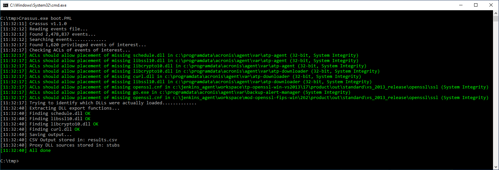

### DLL Hijacking

By planting our compiled `curl.dll` file in the `C:\ProgramData\Acronis\Agent\var\atp-downloader\` directory and rebooting with a new Process Monitor boot log we can see that our payload that runs calc.exe runs, with SYSTEM privileges.
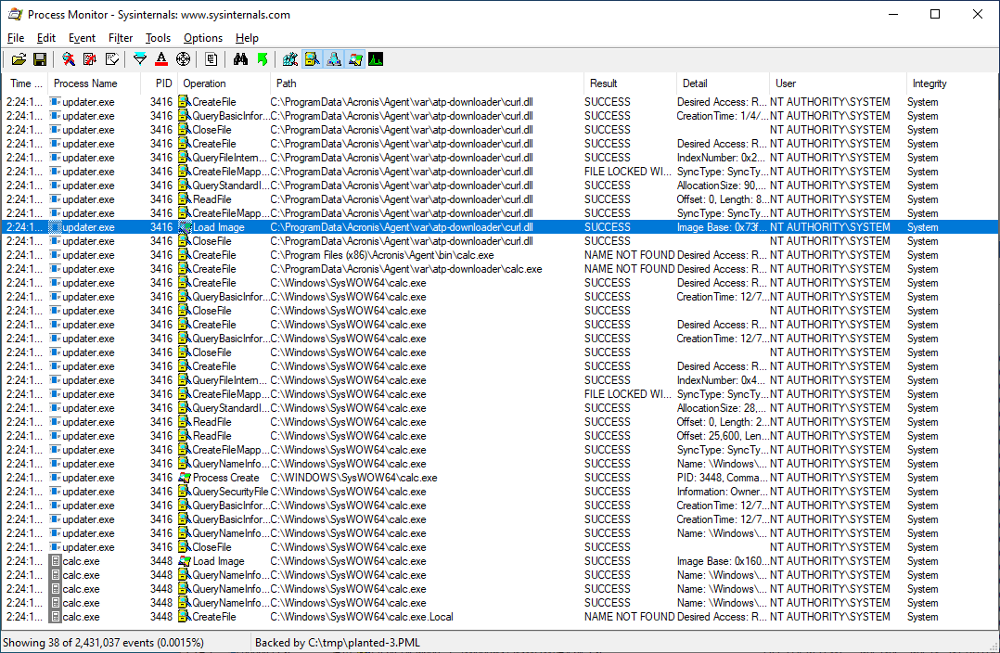

### openssl.cnf Placement

The vulnerable Acronis software attempts to load `openssl.cnf` from two different locations. We'll place our template `openssl.cnf` file in `c:\jenkins_agent\workspace\tp-openssl-win-vs2013\17\product\out\standard\vs_2013_release\openssl\ssl`, and a 32-bit `calc.dll` payload in `c:\tmp`.
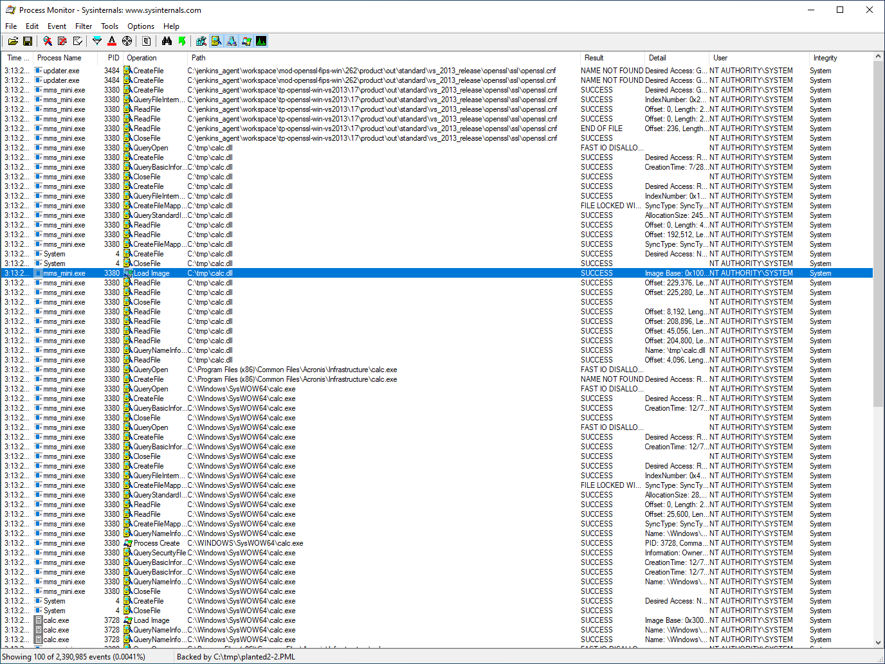

## Atlassian Bitbucket

### Crassus Analysis

As outlined in [VU#240785](https://kb.cert.org/vuls/id/240785), older Atlassian Bitbucket software is vulnerable to privilege escalation due to weak ACLs of the installation directory. As with any Windows software that installs to a location outside of `C:\Program Files\` or other ACL-restricted locations, it is up to the software installer to explicitly set ACLs on the target directory.

Crassus finds many ways to achieve privilege escalation with this software, including:
* Placement of missing DLLs in user-writable locations.
* Placement of missing EXEs in user-writable locations.
* Renaming the directory of a privileged EXE to allow user placement of an EXE of the same name.

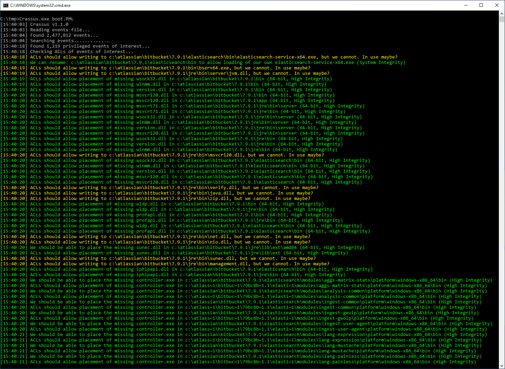

### EXE Hijacking

In the Crassus output, we can see that `c:\atlassian\bitbucket\7.9.1\elasticsearch\bin\elasticsearch-service-x64.exe` is privileged, but since it's running we cannot simply replace it. However, we can use another trick to hijack it. We may be able to simply rename the directory that it lives in, create a new directory of the same name, and plant our payload there as the same name.
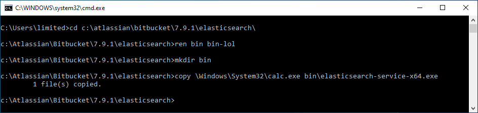

Once we reboot with a Process monitor boot log, we can see that our planted `elasticsearch-service-x64.exe` file is running instead of the real one, based on the Windows Calculator icon.
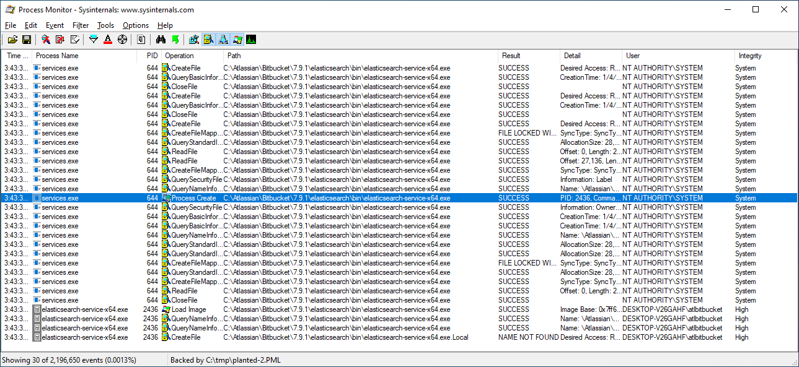

## McAfee

As outlined in [VU#287178](https://kb.cert.org/vuls/id/287178), older versions of McAfee software are vulnerable to privilege escalation via `openssl.cnf`. Let's have a look:
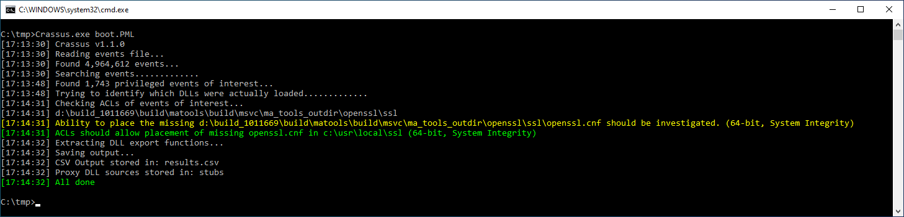

To see why there are two different references to `openssl.cnf` in this boot log, we can refer to the `results.csv` file:
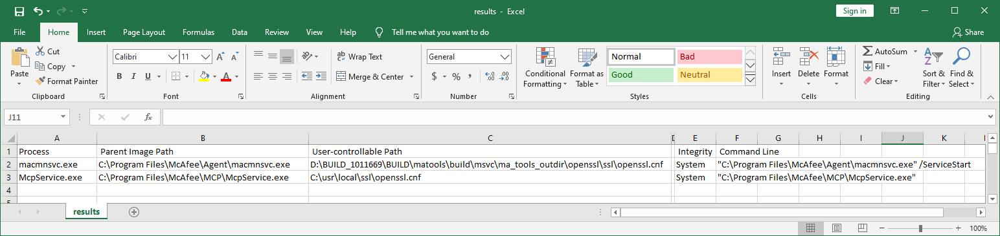

Note that the loading of the `openssl.cnf` file from the `D:\` path will require further manual investigation, as the feasibility of loading such a path depends on the platform in question, and what access to the system is available. It may be possible to create an optical disk that provides an `openssl.cnf` file that also refers to a path that resolves to the optical drive as well.

## Microsoft SQL Server 2022

SQL Server 2022 isn't obviously vulnerable to privilege escalation due to weak ACLs **unless** it is installed to a non-standard location. If it is installed to a location outside of `C:\Program Files`, Crassus will uncover several possibilities for privilege escalation. Most Windows applications that include a privileged component appear to be exploitable in this manner if they are installed to a directory that doesn't already have inherently secure ACLs.
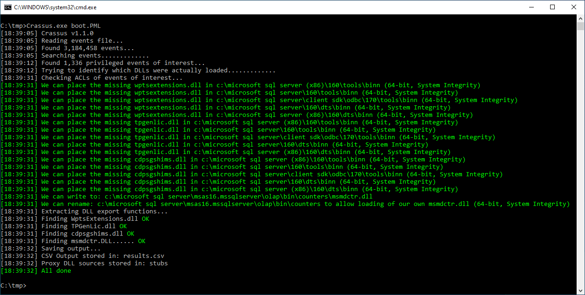

# Troubleshooting

## Missing file not executed

If Crassus reports the privileged loading of a file that a user can plant or modify, this doesn't necessarily mean that it's an exploitable scenario. While Crassus looks for **potentially** interesting file types, a Process Monitor log file will not directly indicate what the associated process **would have** done with the file with it if it were there. It could be as simple as extracting a program icon. Investigating the call stack of the file operation in Process Monitor may give a hint as to what would have been done. Or simply place the file and investigate the behavior with a new Process Monitor boot log, if you prefer the easier brute force path. You may also encounter a missing library where either Crassus cannot find the library to know what exports should be present, or that the exports that Crassus found conflict in a way that prevents proper DLL compilation. In such cases, Crassus will fall back to creating a DLL that does not export any function names. Depending on how the target application loads the library, the absence of expected function names and/or ordinal numbers may prevent the target application from successfully loading the library. This scenario will require manual effort to determine what the proxy DLL should look like.

## Code executed with unexpected privileges

Crassus will look for privileged file operations to discover paths of interest. You may encounter a scenario where both a privileged and an unprivileged process access a path, but only the non-privileged process is the one that does the execution of what may be present. Alternatively, you may encounter a scenario where a parent process does run with privileges, but it may explicitly spawn child processes with lower privileges.

## Findings disappear on reboot

Especially when installing software for the first time, or when installing updates, Process Monitor may log a file operation that looks to be exploitable but does not occur every time that the system boots. Exploiting these operations may be possible on the first reboot after such an event happens. To avoid such edge cases, confirm that subsequent boot logs contain the same reported file operations on subsequent reboots.


# Contributions
Whether it's a typo, a bug, or a new feature, Crassus is very open to contributions as long as we agree on the following:
* You are OK with the MIT license of this project.
* Before creating a pull request, create an issue so it could be discussed before doing any work as internal development is not tracked via the public GitHub repository. Otherwise, you risk having a pull request rejected if for example we are already working on the same/similar feature, or for any other reason.

# Credits

* https://github.com/eronnen/procmon-parser/
